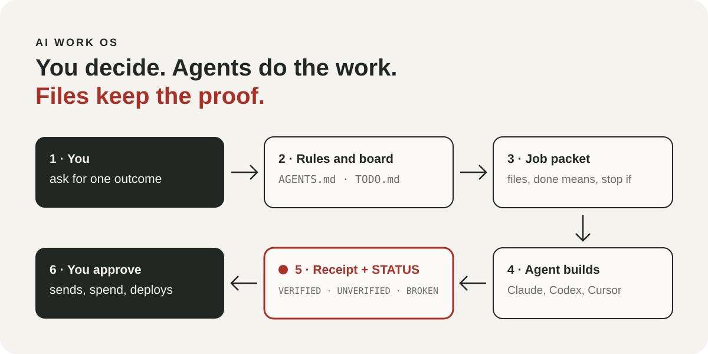
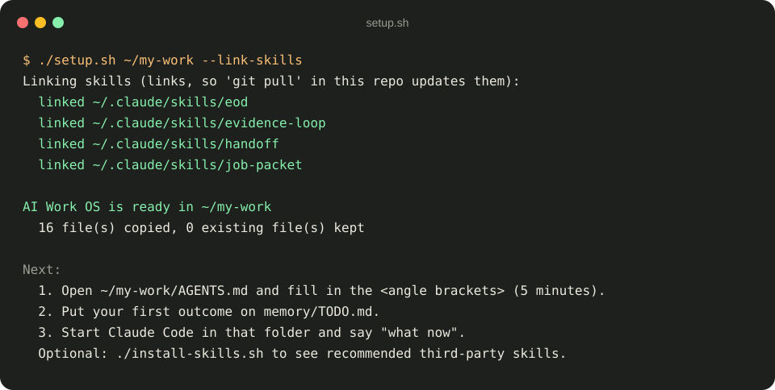
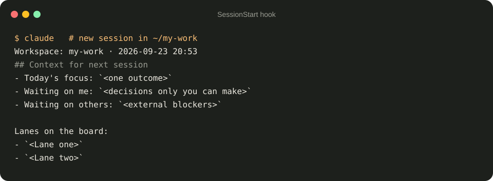
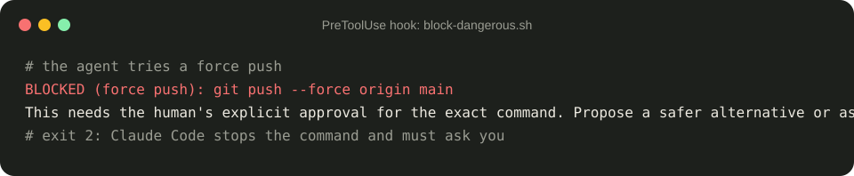
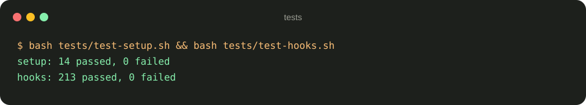
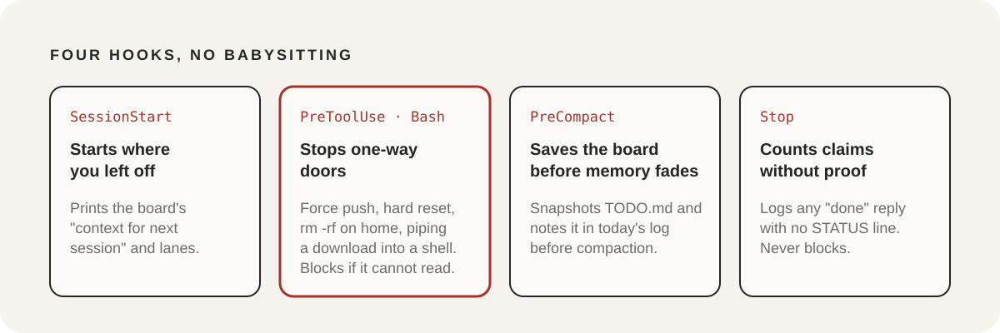

<div align="center">

# AI Work OS

**Run your work with AI agents like a small, careful company.**
You decide. Agents do the work. Files keep the proof.

[](LICENSE)
[](https://docs.claude.com/en/docs/claude-code)
[](template/AGENTS.md)
[](tests)
[](https://github.com/Rebelzxr/ai-work-os/commits)

</div>

<p align="center">
  
</p>

AI agents can write code, research and build all day. The hard part is not getting work out of them. It is knowing what they actually did, stopping them before a one-way-door command, and picking up tomorrow where you left off today.

This is the operating layer I run my own business on, cleaned up so anyone can use it: one rules file every agent reads, one board, job hand-offs with receipts, evidence before any "done", and four Claude Code hooks that do the babysitting. No server, no account, no subscription. Plain files and a few scripts.

**Needs:** bash, git and python3 (the hooks use it). The hooks run in Claude Code; the rest works with any agent that reads files.

## Quick start

```bash
git clone https://github.com/Rebelzxr/ai-work-os.git
cd ai-work-os
./setup.sh ~/my-work --link-skills
```

Then open `~/my-work/AGENTS.md`, replace the `<angle brackets>` with your own details (about five minutes), start Claude Code in `~/my-work` and say **"what now"**.

Using Codex as well? Add `--codex` to link the skills into `~/.codex/skills` too.

## What it gives you

- **One rules file for every agent.** `AGENTS.md` says who decides what, which actions always need you, and how work is handed over. Claude Code, Codex and Cursor all read it.
- **One board.** `memory/TODO.md` answers "what is going on" in one screen, and a new chat starts from it.
- **Job packets and receipts.** Hand work between agents with exact files, a clear finish line and stop conditions. Every finished job leaves a receipt.
- **Evidence before claims.** Every task-shaped reply ends with `STATUS: VERIFIED`, `UNVERIFIED` or `BROKEN`, backed by the checks that were actually run.
- **Hooks that stop one-way doors.** Common forms of force pushes, hard resets, deleting your home folder and running a downloaded script wait for your approval. The hook reads a command roughly the way bash does, so a subshell, an `if` block or a line break does not hide it. If the check crashes, it blocks. The full rule list is in [docs/how-it-works.md](docs/how-it-works.md).
- **Four working skills.** `evidence-loop`, `job-packet`, `handoff` and `eod`.
- **A curated list of other people's best skills,** installed from their own repos with credit.

## See it work

**Setup** copies the template and links the skills. Running it again never overwrites your edits unless you ask.

<p align="center"></p>

**A new session starts where you left off.** The SessionStart hook prints the board's resume block and lanes.

<p align="center"></p>

**A one-way-door command waits for you.** The agent tried a force push; the hook stopped it and told it to ask.

<p align="center"></p>

**Everything is tested,** including tricks to slip a command past the hook and harmless commands that must never be blocked.

<p align="center"></p>

## Real use

This is a cleaned-up copy of the system behind [dainer.ai](https://dainer-ai.vercel.app): its free [library](https://dainer-ai.vercel.app/library), the daily [AI news](https://dainer-ai.vercel.app/news) picker and site releases go through the same board, packets, receipts and STATUS lines. Two agents share the work, Claude and Codex, each owning its own lanes. The private version holds client work, so this public one keeps the method and none of the data.

## How it works

<p align="center"></p>

1. **You ask for one outcome.** Your request authorises the reversible local work it needs.
2. **The rules and the board steer it.** The agent reads `AGENTS.md`, the board row and only the files it needs.
3. **Big or handed-off work gets a job packet** with exact files, acceptance checks and stop conditions.
4. **The agent builds,** inside the files it is allowed to change.
5. **It proves the result** with the matching `evidence-loop` template and writes a receipt ending in one STATUS line.
6. **You approve anything external:** sends, spend, deploys, account changes. The agent asks once, with everything ready.

Full details: [docs/how-it-works.md](docs/how-it-works.md).

## Recommended skills from other people

Installed from their own repos, never copied. Run `./install-skills.sh` for the list and official install commands.

| Skill | By | For |
|---|---|---|
| [superpowers](https://github.com/obra/superpowers) | Jesse Vincent | Plan, test first, debug, verify before claiming done |
| [gstack](https://github.com/garrytan/gstack) | Garry Tan | CEO, designer, eng manager, release and QA roles |
| [andrej-karpathy-skills](https://github.com/multica-ai/andrej-karpathy-skills) | forrestchang | Coding pitfalls to avoid, drawn from Karpathy's observations (linked only) |
| [huashu-design](https://github.com/alchaincyf/huashu-design) | alchaincyf | HTML prototypes, slides, motion, design review |
| [last30days](https://github.com/mvanhorn/last30days-skill) | Matt Van Horn | What people said about a topic in the last 30 days |
| [impeccable](https://github.com/pbakaus/impeccable) | Paul Bakaus | Design language and UI critique |
| [ui-ux-pro-max](https://github.com/nextlevelbuilder/ui-ux-pro-max-skill) | nextlevelbuilder | Styles, palettes, font pairings |
| [agent-browser](https://github.com/vercel-labs/agent-browser) | Vercel Labs | Browser automation for agents |
| [fable-forge](https://github.com/Rebelzxr/fable-forge) | Dainer | Website design with real render evidence |

More in [docs/third-party-skills.md](docs/third-party-skills.md).

## Safety and data flow

- Everything is local: markdown files and small bash and Python scripts in your own folder.
- The hooks read the command the agent is about to run, or the transcript file on your machine, and only write inside your workspace (`memory/`).
- Nothing is sent over the network by this repo. `install-skills.sh` prints commands and runs one only when you pass `--run` and confirm.
- The rules tell agents never to print secrets, never to paste private client data into other tools, and to back up before deleting shared data.

## Limitations

- The hooks need Claude Code. Other agents follow the rules file but are not stopped by the hooks.
- The dangerous-command hook is a pattern check, not a sandbox. It catches the common forms of these one-way doors, including inside subshells, `if`/`for`/`case` blocks, `$(...)`, `bash -c`, `eval`, `ssh host '...'` and a script written or downloaded then run in the same command. It does not follow:
  - variables and aliases (`x=rm; $x -rf ~`);
  - code inside Python or Node programs;
  - a script written in one command and run in a later one;
  - commands run by other tools, such as `docker exec`, `xargs`, `find -exec` and `git submodule foreach`;
  - SQL sent to a database on another machine over `ssh`.
  
  Its bash reader is small, so unusual syntax can be misread without a warning.
- The STATUS check only logs; it cannot tell whether the evidence in a STATUS line is true. That is what independent review is for.
- Scripts are bash. On Windows, use WSL or Git Bash.

## Repo structure

```text
ai-work-os/
├── setup.sh              copy the template into your workspace, link the skills
├── install-skills.sh     recommended third-party skills, from their own repos
├── template/             what lands in your workspace
│   ├── AGENTS.md         rules every agent reads
│   ├── CLAUDE.md         Claude Code entry point and lane routing
│   ├── WORKFLOW.md       the six-step job loop
│   ├── memory/TODO.md    the one active board
│   ├── dispatch/         job packets in, receipts out (with an example)
│   ├── lanes/example/    per-project rules
│   ├── scripts/hooks/    SessionStart, PreToolUse, PreCompact, Stop
│   └── .claude/settings.json   hook wiring
├── skills/               evidence-loop, job-packet, handoff, eod
├── docs/                 how it works, third-party skills, lessons, FAQ
├── tests/                227 checks for setup, skills and hooks
└── assets/               the images in this README
```

## Lessons from running it

The rules here were learned the hard way. Two examples:

- **Keep the AI model out of the critical path.** A daily job that needed a model stopped the day the quota ran out. Now plain code does the essential step and the model only polishes.
- **A fresh reviewer finds what the author cannot.** An article the author had already checked scored 8.4 out of 10 from an independent reviewer, which caught a misread contract clause. After fixes, 9.3.

All ten: [docs/lessons.md](docs/lessons.md).

## Credits and licence

MIT, see [LICENSE](LICENSE). The third-party skills listed above belong to their authors under their own licences, and this repo only links to them:

- [superpowers](https://github.com/obra/superpowers) by Jesse Vincent (MIT)
- [gstack](https://github.com/garrytan/gstack) by Garry Tan (MIT)
- [andrej-karpathy-skills](https://github.com/multica-ai/andrej-karpathy-skills) by forrestchang (README says MIT; no LICENSE file, so linked only)
- [huashu-design](https://github.com/alchaincyf/huashu-design) by alchaincyf (MIT)
- [last30days](https://github.com/mvanhorn/last30days-skill) by Matt Van Horn (MIT)
- [impeccable](https://github.com/pbakaus/impeccable) by Paul Bakaus (Apache-2.0)
- [ui-ux-pro-max](https://github.com/nextlevelbuilder/ui-ux-pro-max-skill) (MIT)
- [agent-browser](https://github.com/vercel-labs/agent-browser) by Vercel Labs (Apache-2.0)

The working principles draw on ideas from these projects, especially the Karpathy-inspired coding guidelines, superpowers and gstack.

## About

Built by Dainer in Kuala Lumpur. I build with AI and share what's worth teaching from real work and business.
Free library: [dainer-ai.vercel.app/library](https://dainer-ai.vercel.app/library) · Site: [dainer-ai.vercel.app](https://dainer-ai.vercel.app)

Related: [second-brain-agent](https://github.com/Rebelzxr/second-brain-agent) (notes that agents can use) · [ai-news-picker](https://github.com/Rebelzxr/ai-news-picker) · [fable-forge](https://github.com/Rebelzxr/fable-forge)
