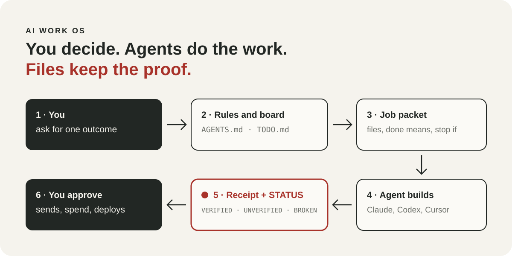
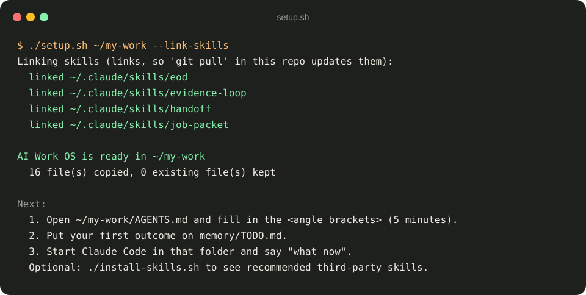
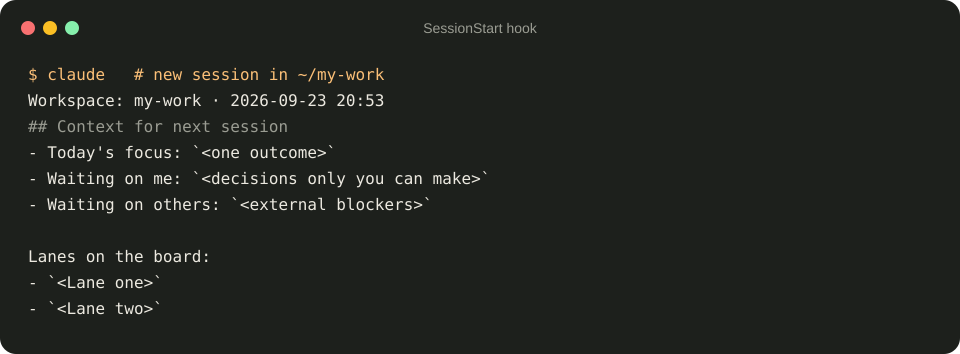
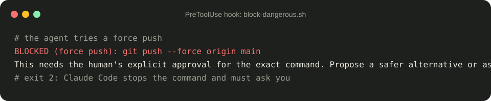
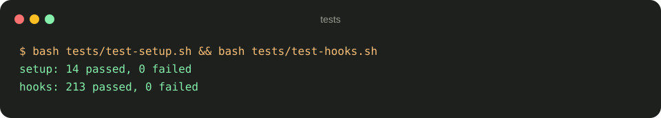
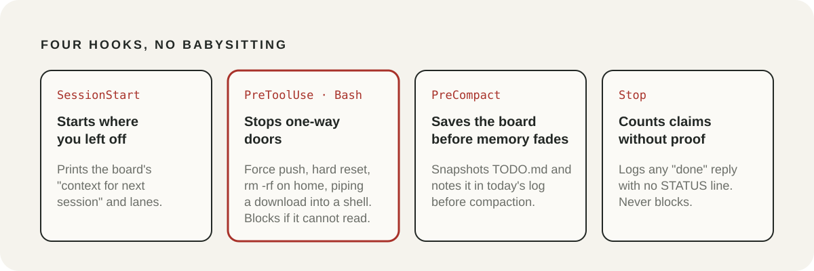

<div align="center">

# AI Work OS

**A practical AI workspace for small-business owners.**
You decide. Agents do the work. Files keep the proof.

[](LICENSE)
[](https://docs.claude.com/en/docs/claude-code)
[](template/AGENTS.md)
[](tests)
[](https://github.com/Rebelzxr/ai-work-os/commits)

</div>

<p align="center">
  
</p>

AI agents can write code, research and build all day. The hard part is not getting work out of them. It is knowing what they actually did, stopping them before a one-way-door command, and picking up tomorrow where you left off today.

This is the operating layer I run my own business on, cleaned up so anyone can use it: one rules file every agent reads, one board, job hand-offs with receipts, evidence before any "done", and four Claude Code hooks that do the babysitting. The kit is free: plain files and a few scripts, with no kit account or subscription. Claude Code or Codex may need a paid plan; their costs and terms are separate.

**Needs:** bash, git and python3 (the hooks use it). The dangerous-command hook runs in Claude Code today; Codex hook wiring is tracked, not shipped yet (see [docs/roadmap.md](docs/roadmap.md)). The rules file, board and skills work with any agent that reads files.

## Quick start

### Create a new workspace (start here)

This complete route creates your rules, board and hooks, and adds the five default skill packs to this project only:

```bash
git clone https://github.com/Rebelzxr/ai-work-os.git
cd ai-work-os
./setup.sh ~/my-work --link-skills
cd ~/my-work
claude
```

Say **"onboard"**, then **"what now"**. Start customer-drafting skills with made-up examples. Before any later real input, remove names, IC numbers, phone numbers, bank details and addresses locally in your own editor, before pasting into AI. `safe-to-paste` is only a second check after local cleaning.

Using Codex? Add `--codex` to the setup command, then start `codex` in `~/my-work`. The kit's automatic command hooks currently run in Claude Code only.

### Add skills to an existing workspace (plugins)

Plugins add skills only; they do not create `AGENTS.md`, the board or workspace hooks. Use the route above if those are missing.

```bash
claude plugin marketplace add Rebelzxr/ai-work-os
claude plugin install aiwos-core@ai-work-os --scope project
claude plugin install aiwos-business@ai-work-os --scope project
```

Optional thinking tools: `./setup.sh ~/my-work --link-skills --pack thinking` (add `--codex` for Codex), or `claude plugin install aiwos-thinking@ai-work-os --scope project`.

Full options: [docs/install.md](docs/install.md).

## Upgrading from v1

Already running v1 or an earlier v2 in a workspace? Update this clone, then start with `./setup.sh ~/my-work --upgrade` to see per-file differences, then merge wanted changes into your own files. A normal setup run only adds missing files and links. Existing global links from older installs remain until you remove them yourself. For deliberate replacement only, `--force` backs up each replaced file or link under the workspace's timestamped `.aiwos-backups/` folder and prints every backup path.

## What it gives you

- **One rules file for every agent.** `AGENTS.md` says who decides what, which actions always need you, and how work is handed over. Claude Code, Codex and Cursor all read it.
- **One board.** `memory/TODO.md` answers "what is going on" in one screen, and a new chat starts from it.
- **Job packets and receipts.** Hand work between agents with exact files, a clear finish line and stop conditions. Every finished job leaves a receipt.
- **Evidence before claims.** Every task-shaped reply ends with `STATUS: VERIFIED`, `UNVERIFIED` or `BROKEN`, backed by the checks that were actually run.
- **Hooks that stop one-way doors.** Common forms of force pushes, hard resets, deleting your home folder and running a downloaded script wait for your approval. The hook reads a command roughly the way bash does, so a subshell, an `if` block or a line break does not hide it. If the check crashes, it blocks. The full rule list is in [docs/how-it-works.md](docs/how-it-works.md).
- **17 default skills, plus 7 optional thinking tools.** Five packs cover the starting set for a small-business owner:
  - `aiwos-core` (6 skills) — `evidence-loop`, `job-packet`, `handoff`, `eod`, plus `onboard` (fills in AGENTS.md and the board for you) and `what-now` (the daily bottleneck, read-only). Start here: `claude plugin install aiwos-core@ai-work-os --scope project`.
  - `aiwos-business` (6 skills) — `lead-triage`, `whatsapp-reply`, `quote-from-message`, `safe-to-paste`, `check-before-send`, `voice-note-to-sop`. Drafts only, a person always sends: `claude plugin install aiwos-business@ai-work-os --scope project`.
  - **Optional:** `aiwos-thinking` (7 skills) — `goal`, `feature-to-feeling`, `packaging-audit`, `price-copy-audit`, `prompt-contract`, `reverse-prompt`, `stochastic-multi-agent-consensus`: `claude plugin install aiwos-thinking@ai-work-os --scope project`.
  - `aiwos-marketing` (3 skills) — `gbp-posts`, `follow-up-drafts`, `content-from-real-work`. Drafts only: `claude plugin install aiwos-marketing@ai-work-os --scope project`.
  - `aiwos-web` (1 skill) — `site-loop`: brief, build, local preview, phone/desktop light/dark captures, console-error check, an explicitly approved preview deploy. Never runs a production deploy: `claude plugin install aiwos-web@ai-work-os --scope project`.
  - `aiwos-video` (1 skill) — `video-brief` plus a caption lint for common mistakes (`packs/video/scripts/check-captions.py`, beta: it catches common SRT/WebVTT mistakes, but it is not a full validator, so still play the file in your video tool before publishing). Never renders or publishes video: `claude plugin install aiwos-video@ai-work-os --scope project`.

  Each needs `claude plugin marketplace add Rebelzxr/ai-work-os` first. See [docs/install.md](docs/install.md) and [docs/packs.md](docs/packs.md) for the full picture, including the `setup.sh --pack` route.
- **A curated list of other people's best skills,** installed from their own repos with credit.

## See it work

**Setup** copies the template and links the skills. Running it again never overwrites your edits unless you ask.

<p align="center"></p>

**A new session starts where you left off.** The SessionStart hook prints the board's resume block and lanes.

<p align="center"></p>

**A one-way-door command waits for you.** The agent tried a force push; the hook stopped it and told it to ask.

<p align="center"></p>

**What the checks prove:**

- **Script tests run code:** hook decisions, setup file operations and backups, task selection, onboarding path/workspace checks, doctor configuration checks and caption lint.
- **Structural checks inspect skill files:** frontmatter, local script paths, privacy and approval wording, and fixture/checklist presence. A sample regex test also checks made-up identifiers; it is not an upload filter.
- **Not tested here:** AI skill output quality, factual accuracy of generated replies or quotes, the live onboarding interview, or every runtime's plugin-install flow. People must check drafts against their source facts before manually sending.

The badge is the sum of reported checks in seven suites: six script suites plus `tests/packs/run.sh`. It includes structural checks, not just behavior tests. Standalone frontmatter and plugin validation are additional checks outside that sum.

<p align="center"></p>

## Real use

This is a cleaned-up copy of the system behind [dainer-ai.biz](https://dainer-ai.biz): its free [library](https://dainer-ai.biz/library), the daily [AI news](https://dainer-ai.biz/news) picker and site releases go through the same board, packets, receipts and STATUS lines. Two agents share the work, Claude and Codex, each owning its own lanes. The private version holds client work, so this public one keeps the method and none of the data.

## How it works

<p align="center"></p>

1. **You ask for one outcome.** Your request authorises the reversible local work it needs.
2. **The rules and the board steer it.** The agent reads `AGENTS.md`, the board row and only the files it needs.
3. **Big or handed-off work gets a job packet** with exact files, acceptance checks and stop conditions.
4. **The agent builds,** inside the files it is allowed to change.
5. **It proves the result** with the matching `evidence-loop` template and writes a receipt ending in one STATUS line.
6. **You approve anything external:** sends, spend, deploys, account changes. The agent asks once, with everything ready.

Full details: [docs/how-it-works.md](docs/how-it-works.md).

## Recommended skills from other people

Installed from their own repos, never copied. Run `./install-skills.sh` for the list and official install commands.

| Skill | By | For |
|---|---|---|
| [superpowers](https://github.com/obra/superpowers) | Jesse Vincent | Plan, test first, debug, verify before claiming done |
| [gstack](https://github.com/garrytan/gstack) | Garry Tan | CEO, designer, eng manager, release and QA roles |
| [andrej-karpathy-skills](https://github.com/multica-ai/andrej-karpathy-skills) | forrestchang | Coding pitfalls to avoid, drawn from Karpathy's observations (linked only) |
| [huashu-design](https://github.com/alchaincyf/huashu-design) | alchaincyf | HTML prototypes, slides, motion, design review |
| [last30days](https://github.com/mvanhorn/last30days-skill) | Matt Van Horn | What people said about a topic in the last 30 days |
| [impeccable](https://github.com/pbakaus/impeccable) | Paul Bakaus | Design language and UI critique |
| [ui-ux-pro-max](https://github.com/nextlevelbuilder/ui-ux-pro-max-skill) | nextlevelbuilder | Styles, palettes, font pairings |
| [agent-browser](https://github.com/vercel-labs/agent-browser) | Vercel Labs | Browser automation for agents |
| [fable-forge](https://github.com/Rebelzxr/fable-forge) | Dainer | Website design with real render evidence |

More in [docs/third-party-skills.md](docs/third-party-skills.md).

## Safety and data flow

- The kit stores markdown files and small bash and Python scripts in your own folder. The AI tool you run it in sends your prompts and the files it reads to its model provider; a local folder does not make the model local.
- The hooks read the command the agent is about to run, or the transcript file on your machine, and only write inside your workspace (`memory/`).
- The kit itself sends no customer messages or drafts. Network exceptions: `doctor.sh` runs `gh auth status`, which contacts GitHub and reports authentication state only; `install-skills.sh --run` runs an installer after confirmation; clone, update and plugin/skill install commands contact their hosts. Third-party tools and AI providers have their own data policies.
- The rules tell agents never to print secrets, never to paste private client data into other tools, and to back up before deleting shared data.

## Limitations

- Codex hook wiring: coming, tracked in [docs/roadmap.md](docs/roadmap.md). Claude Code has the dangerous-command hook today; other agents, including Codex, follow the rules file but are not stopped by a hook yet.
- The dangerous-command hook is a pattern check, not a sandbox. It catches the common forms of these one-way doors, including inside subshells, `if`/`for`/`case` blocks, `$(...)`, `bash -c`, `eval`, `ssh host '...'` and a script written or downloaded then run in the same command. It does not follow:
  - variables and aliases (`x=rm; $x -rf ~`);
  - code inside Python or Node programs;
  - a script written in one command and run in a later one;
  - commands run by other tools, such as `docker exec`, `xargs`, `find -exec` and `git submodule foreach`;
  - SQL sent to a database on another machine over `ssh`.
  
  Its bash reader is small, so unusual syntax can be misread without a warning.
- The STATUS check only logs; it cannot tell whether the evidence in a STATUS line is true. That is what independent review is for.
- Scripts are bash. On Windows, use WSL or Git Bash.

## Repo structure

```text
ai-work-os/
├── .claude-plugin/marketplace.json   one-command plugin install (Claude Code; legacy-compatible with Codex)
├── setup.sh              copy the template into your workspace, link the skills
├── doctor.sh             read-only health check: tools, hook configuration, skills available
├── install-skills.sh     recommended third-party skills, from their own repos
├── packs/
│   ├── core/             the aiwos-core plugin (6 skills): .claude-plugin/plugin.json + skills/
│   ├── business/         the aiwos-business plugin (6 skills): SME drafting skills, nothing sends
│   ├── thinking/         the aiwos-thinking plugin (7 skills): scoping, copy and review tools
│   ├── marketing/        the aiwos-marketing plugin (3 skills): GBP posts, follow-ups, content drafts
│   ├── web/              the aiwos-web plugin (1 skill): site-loop, stops before production
│   └── video/            the aiwos-video plugin (1 skill): video-brief + a caption lint script
├── template/             what lands in your workspace
│   ├── AGENTS.md         rules every agent reads
│   ├── CLAUDE.md         Claude Code entry point and lane routing
│   ├── WORKFLOW.md       the six-step job loop
│   ├── memory/TODO.md    the one active board
│   ├── dispatch/         job packets in, receipts out (with an example)
│   ├── lanes/example/    per-project rules
│   ├── scripts/hooks/    SessionStart, PreToolUse, PreCompact, Stop
│   └── .claude/settings.json   hook wiring
├── skills/               compatibility symlinks into packs/core/skills/ (v1 clone paths keep working)
├── docs/                 install, packs, roadmap, how it works, third-party skills, links, connect, lessons, FAQ
├── tests/                script tests and structural skill checks
└── assets/               the images in this README
```

## Lessons from running it

The rules here were learned the hard way. Two examples:

- **Keep the AI model out of the critical path.** A daily job that needed a model stopped the day the quota ran out. Now plain code does the essential step and the model only polishes.
- **A fresh reviewer finds what the author cannot.** An article the author had already checked scored 8.4 out of 10 from an independent reviewer, which caught a misread contract clause. After fixes, 9.3.

All ten: [docs/lessons.md](docs/lessons.md).

## Credits and licence

MIT, see [LICENSE](LICENSE). The third-party skills listed above belong to their authors under their own licences, and this repo only links to them:

- [superpowers](https://github.com/obra/superpowers) by Jesse Vincent (MIT)
- [gstack](https://github.com/garrytan/gstack) by Garry Tan (MIT)
- [andrej-karpathy-skills](https://github.com/multica-ai/andrej-karpathy-skills) by forrestchang (README says MIT; no LICENSE file, so linked only)
- [huashu-design](https://github.com/alchaincyf/huashu-design) by alchaincyf (MIT)
- [last30days](https://github.com/mvanhorn/last30days-skill) by Matt Van Horn (MIT)
- [impeccable](https://github.com/pbakaus/impeccable) by Paul Bakaus (Apache-2.0)
- [ui-ux-pro-max](https://github.com/nextlevelbuilder/ui-ux-pro-max-skill) (MIT)
- [agent-browser](https://github.com/vercel-labs/agent-browser) by Vercel Labs (Apache-2.0)
- [HyperFrames](https://github.com/heygen-com/hyperframes) (Apache-2.0) — default hand-off target for `aiwos-video`'s `video-brief`
- [marketingskills](https://github.com/coreyhaines31/marketingskills) by Corey Haines (MIT)
- [video-use](https://github.com/browser-use/video-use) (MIT)
- [Remotion skills](https://github.com/remotion-dev/skills) / [Remotion](https://github.com/remotion-dev/remotion) — link only; see [docs/links.md](docs/links.md) for the 3-employee licence warning
- [claude-plugins-official](https://github.com/anthropics/claude-plugins-official) (Apache-2.0 directory: playwright, frontend-design, github plugins)

Full licence and star-count detail for the above, checked live on 29 September 2026: [docs/links.md](docs/links.md).

The working principles draw on ideas from these projects, especially the Karpathy-inspired coding guidelines, superpowers and gstack.

## About

Built by Dainer in Kuala Lumpur. I build with AI and share what's worth teaching from real work and business.
Free library: [dainer-ai.biz/library](https://dainer-ai.biz/library) · Site: [dainer-ai.biz](https://dainer-ai.biz)

Related: [second-brain-agent](https://github.com/Rebelzxr/second-brain-agent) (notes that agents can use) · [ai-news-picker](https://github.com/Rebelzxr/ai-news-picker) · [fable-forge](https://github.com/Rebelzxr/fable-forge)
